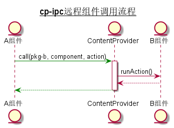
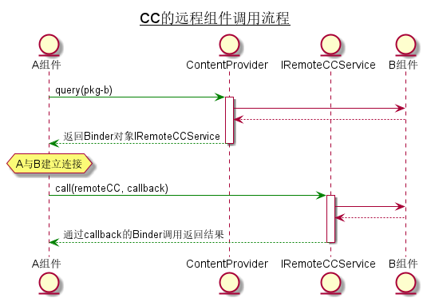

## cp-ipc
cp-ipc是基于ContentProvider实现的跨进程通信工具。

### 适用场景
组件化开发过程中的组件跨进程调用。对性能要求不高。

### 原理
通过ContentProvider的call()执行跨进程请求；AIDL配合实现请求结果回调。



### 使用
1. 通过`IPCCaller.setSupport()`初始化IPCCaller。
2. 同步调用：`IPCCaller.call()`
3. 异步调用：`IPCCaller.callAsync()`
4. 异步调用(通过Handler指定回调线程)：`IPCCaller.callAsyncCallbackOnHandler()`

### 扩展
`IPCRequest`定义了如下字段：
```
private String componentName;//组件名
private String actionName;//action名(action是组件对外提供的功能，可以理解为一个类的方法)
private HashMap<String, Object> params;//组件调用的参数
private String callId;//组件调用方生成的callId
private boolean isMainThreadSyncCall;//这个调用是在主线程发起，所以在组件B中也应该在主线程执行

private Bundle extra;
```
上面定义这么多字段，也不可能覆盖所有的需求。所有预定义了extra字段供扩展。可以参考我的demo：MyIPCRequestTest


### 单元测试
1. 先运行`app-target`，它就是跨进程通信的组件B
1. 再运行[`com.billy.cc.core.ipc.InstrumentedTest`](cp-ipc/src/androidTest/java/com/billy/cc/core/ipc/InstrumentedTest.java)，它就是跨进程通信的组件A


### 为什么写cp-ipc
首先感谢[CC](https://github.com/luckybilly/CC)，部分代码直接来自于CC。
个人认为CC是对程序员最友好的组件化框架，它真正做到了单独编译、运行一个组件，而且可以跨app调用其它组件。

我们上组件化有三个原因：一是组件解耦，二是组件单独编译、运行，三是单独运行的组件可以调用其它组件。

对于第三点，很多组件化框架做不到，如[ARouter](https://github.com/alibaba/ARouter/issues/637)。这样的组件化开发是不完美的。
> “这不是 ARouter 需要考虑的问题”

这样的回答貌似也没毛病。但是，能单独编译运行，却不能很完美地运行，不能和其它组件交互，这样的组件化框架用着不太爽吧？
也许有人会说，如果这个组件和其它组件有太多交互，那只能证明你的组件划分不合理。
那我只能说我太难了！(此处应该有个表情图，最好是带声音的)

当然，ARouter坚持原则也是有道理的。我能不能通过其它的方式实现ARouter增加跨进程调用组件的功能呢？比如，写一个ARouter的plugin，扩展ARouter的功能？
带着这个想法，我参考CC源码中跨进程通信的部分开始写代码了。所以`cp-ipc`不是通用的ipc方案，它设计之初就是为了组件化开发过程中的组件跨进程调用。
注意，是**开发过程中**，以这种方式的跨进程通信不应该被带到线上。

我为什么没有把CC源码中跨进程通信的代码直接抽离出来呢？

[CC的跨进程原理](https://qibilly.com/CC-website/#/article-cc-principle)
概括来讲就是：通过ContentProvider uri直接定位目标进程，然后通过query取得AIDL生成的Binder对象，通过这个Binder对象就可以进程跨进程调用了。
其中巧妙之处就是ContentProvider可以通过uri直接执行，uri一般由app的包名生成。相应的包名又和组件名相关联。而我们组件A如果要调用组件B，肯定知道组件B的名字。

我们知道ContentProvider、AIDL其本质都是Binder，只用ContentProvider可以实现组件间的跨进程通信吗？

后来，我了解到ContentProvider里的call()方法刚好可以满足我的需求。
当然返回结果和CC一样也是AIDL实现。总得来讲，我少写一个请求方的AIDL。

还有一个写cp-ipc的原因：[第2章 组件化选型](https://www.jianshu.com/p/4243b7c7f9be)这篇博客建议"RPC建议专门一个库实现"。
所以，我想能不能抽离CC的ipc部分的代码用到ARouter上。

### CC中的跨进程(对比与cp-ipc的区别)
CC用到ContentProvider的query()，cp-ipc用到ContentProvider的call()。




### 写一个ARouter的跨进程组件调用的plugin的可行性分析
todo


